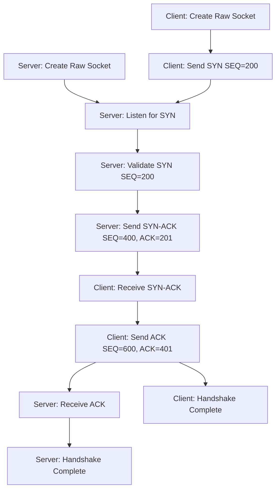

# TCP Handshake Implementation

This project implements a **custom TCP three-way handshake** using raw sockets. It demonstrates the fundamental connection establishment process of TCP by manually constructing and sending IP and TCP packets with specific sequence numbers, flags, and acknowledgments.

---

## Features

### Implemented

- **Server Component:**
  - Listens for incoming SYN packets on port 12345
  - Validates incoming SYN packets with sequence number 200
  - Responds with a SYN-ACK packet (SEQ=400, ACK=201)
  - Confirms successful handshake completion upon receiving final ACK

- **Client Component:**
  - Initiates handshake by sending a SYN packet with sequence number 200
  - Processes received SYN-ACK from server
  - Completes handshake by sending ACK with sequence number 600
  - Confirms successful connection establishment

### Not Implemented

- **Data Transfer:**
  - This implementation only demonstrates handshake establishment, not actual data transfer
- **Connection Termination:**
  - FIN/ACK sequence for connection teardown is not implemented

---

## Design Decisions

### Use of Raw Sockets
- Uses **raw sockets** to have direct control over IP and TCP headers
- Requires root/administrator privileges to run due to raw socket usage

### Fixed Sequence Numbers
- Uses predetermined sequence numbers (200, 400, 600) for demonstration purposes
- Simplifies the implementation while clearly showing the handshake steps

### IP Header Inclusion
- Manually constructs both IP and TCP headers using the `IP_HDRINCL` socket option
- Provides full control over packet contents but requires careful implementation

---

## Implementation Details

### 🛠️ High-Level Overview

Key functions in the project:

#### Server
- **`receive_syn()`** → Listens for incoming SYN packets 
- **`send_syn_ack()`** → Constructs and sends SYN-ACK responses
- **`print_tcp_flags()`** → Displays TCP header flag information

#### Client
- **`send_syn()`** → Initiates handshake with a SYN packet
- **`send_ack()`** → Completes handshake with ACK packet
- **`print_tcp_flags()`** → Displays TCP header flag information

### Code Flow (TCP Handshake)



### Execution Steps

1. **Compilation:** Build server and client using the provided Makefile
2. **Server Start:** Run the server in one terminal (`./server`)
3. **Client Connection:** Run the client in another terminal (`./client`)
4. **Handshake Process:** Observe the exchange of SYN, SYN-ACK, and ACK packets
5. **Completion:** Both sides confirm successful handshake establishment

---

## Building and Running

```bash
# Build both server and client
make all

# Start the server
sudo ./server

# In another terminal, run the client
sudo ./client
```

Note: Root/sudo privileges are required due to raw socket usage.

---

## Technical Details

- **Port Configuration:**
  - Server listens on port 12345
  - Client uses port 54321 as source
- **Sequence Numbers:**
  - Client SYN: SEQ=200
  - Server SYN-ACK: SEQ=400, ACK=201
  - Client ACK: SEQ=600, ACK=401
- **Raw Socket Usage:**
  - Implemented using SOCK_RAW socket type
  - Uses IP_HDRINCL option to include custom IP headers

---

## Contribution

👤 **Palagiri Tousif Ahamad (220744):** 100% Contribution

---

## 🔹 References

- RFC 793: Transmission Control Protocol
- Linux Socket Programming resources
- TCP/IP Illustrated (Stevens)

---